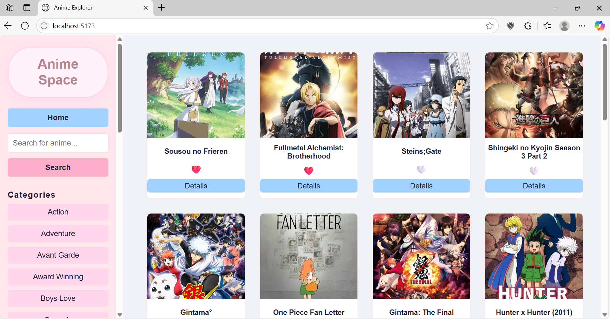
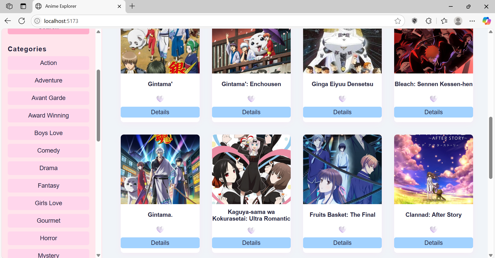
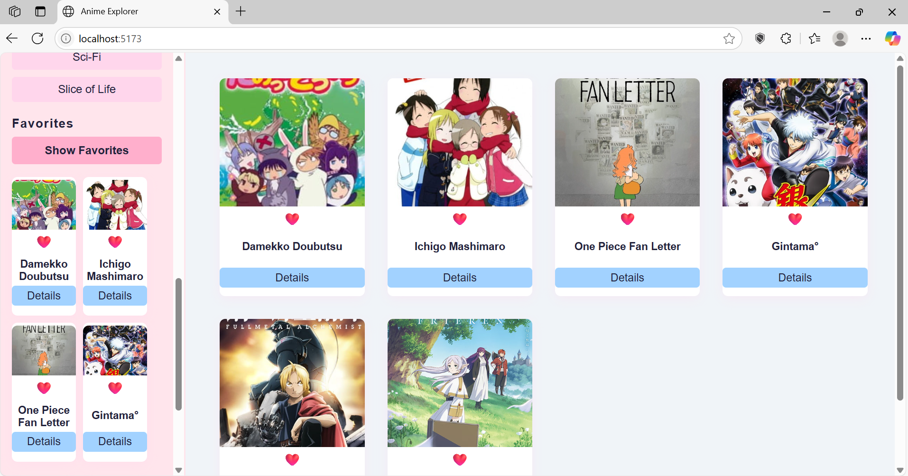
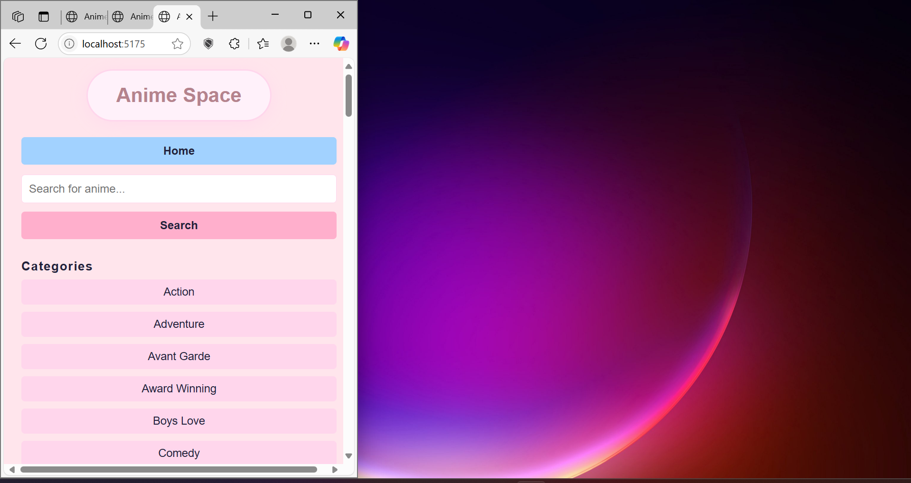
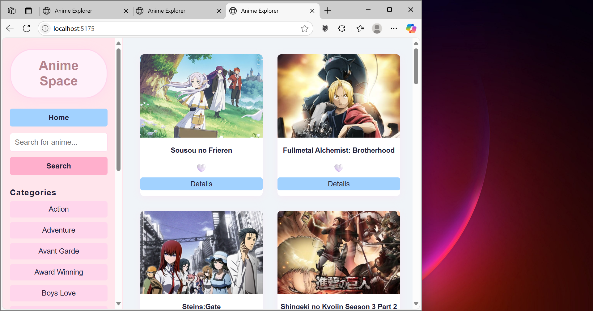

Anime Explorer
📖 Projectbeschrijving
Anime Explorer is een webapplicatie waarmee je populaire anime kunt zoeken, filteren op genre, favorieten kunt opslaan en info (details) van anime kunt bekijken. De app gebruikt de Jikan API en slaat favorieten op in LocalStorage.
Gebouwd met Vite, gescheiden HTML, CSS en JS.

📦 Features
Zoek en filter populaire anime
Bekijk details van elke anime
Sla je favoriete anime op (met LocalStorage)
Filter op genre/categorie
Responsive layout en gebruiksvriendelijke interface

🔗 Gebruikte API
https://api.jikan.moe/v4/anime/{id}/full

⚙️ Implementatie van elke technisch vereiste
DOM manipulatie
Elementen selecteren:
const animeLijst = document.getElementById('anime-list');
anime.js, lijn 3

Elementen manipuleren:
animeLijst.innerHTML = ... in toonAnime()
anime.js, lijn 25

Events aan elementen koppelen:
animeCard.querySelector('.fav-btn').addEventListener(...)
anime.js, lijn 65

Modern JavaScript:
Gebruik van constanten:
const animeLijst = ...
const animeDetails = ...
anime.js, lijn 3 en 4

Template literals:

js
animeCard.innerHTML = `
  
  ...
`;
anime.js, lijn 55

Iteratie over arrays:
animes.forEach(function(anime) { ... })
anime.js, lijn 48

Conditional (ternary) operator:
${isFav ? '❤️' : '🤍'}
anime.js, lijn 59

Promises:
fetch(...), .then(...), .catch(...)
anime.js, lijn 19, 20, 24

Async & Await:
async function haalPopulaireAnimeOpEnToon(...)
anime.js, lijn 6

Observer API:
new IntersectionObserver(...)
anime.js, lijn 77 (na de forEach in toonAnime)

Array methodes:
.findIndex, .push, .splice, .forEach
favorites.js, lijnen 9, 13, 20, 34

Callback functions:
toonFavorietenHoofd(wisselFavoriet, toonAnimeDetails)
favorites.js, lijn 60

Arrow functions:
Gebruikt in event listeners en array methodes, bijvoorbeeld:
categorieLijst.innerHTML = ''; data.data.slice(0, 15).forEach(genre => { ... });
categorieën.js, lijn 6

Data & API
Fetch om data op te halen:
fetch('https://api.jikan.moe/v4/top/anime?limit=24')
anime.js, lijn 9

JSON manipuleren en weergeven:
res.json(), .then(function(data) { ... })
anime.js, lijnen 10, 21

Opslag & validatie
Formulier validatie:
if (zoekterm) { ... }
main.js, lijn 25

Gebruik van LocalStorage:
localStorage.setItem('favorieten', JSON.stringify(favorieten));
favorites.js, lijn 22

Styling & layout
Basis HTML layout:
Zie index.html met <aside>, <main>, en CSS Grid in #anime-list
index.html, style.css

Gebruiksvriendelijke elementen:
Hartje voor favorieten, details-knop, duidelijke foutmeldingen
anime.js, favorites.js, style.css

Basis CSS:
Zie style.css voor kleuren, grid, knoppen, enz.

Tooling & structuur
Project opgezet met Vite:
Zie package.json

Correcte folderstructuur:
De mappen en bestanden zijn logisch gestructureerd voor overzicht

GitHub repository:
https://github.com/na-assht/AnimeExplorer
Regelmatig gecommit, met duidelijke commit messages.

🛠️ Installatiehandleiding
1.Ga naar de projectmap:
Optie 1:
 cd "Web Advanced Project\AnimeExplorer.web" 
 = Dit gebruik je als je al in de map zit.
 
Optie 2:
cd "C:\Users\Nehli\Documents\Web Advanced Project\AnimeExplorer.web" 
= Dit werkt altijd, ongeacht waar je terminal zich bevindt. Het is het volledige pad.

2.Installeer de dependencies:
npm install

3.Start de ontwikkelserver:
npm run dev

4.Open [http://localhost:5173](http://localhost:5173) in je browser.

🖼️ Screenshots van de applicatie
Homepagina:

Categorieën:

Favorieten:

Extra info van anime/Details:
.png)

Responsiviteit:

Gebruikte bronnen
https://chatgpt.com/
https://www.perplexity.ai/
https://paiza.io/en
https://jsfiddle.net/
https://stackedit.io/app#
http://codetester.io/
https://www.google.com/?hl=nl